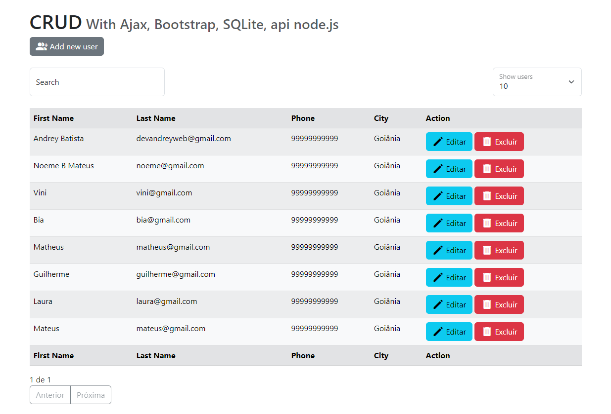

<h1 align="center"> CRUD </h1>
<h2>Getting Started</h2>
<br>

<h3>
<strong>
Primeiro, execute os comandos:
</strong>
</h3>

<br>
<hr>
Para instalar as dependências.

```sh
npm install
```

<hr>
<br>
Para iniciar o servidor:

```sh
node app.js
```

<hr>
<br>
Para iniciar o servidor Web:

```sh
http-server
```

<br>
<br>
<p align="center">
  <a href="#-tecnologias">Tecnologias</a>&nbsp;&nbsp;&nbsp;
</p>
<br>

<p align="center">
  
</p>

<br>
<hr>
## 🚀 Tecnologias

Esse projeto foi desenvolvido com as seguintes tecnologias:

- Javascript
- Node.js
- Sqlit3
- Bootstrap
